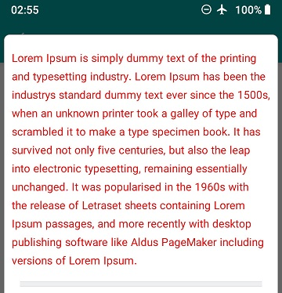
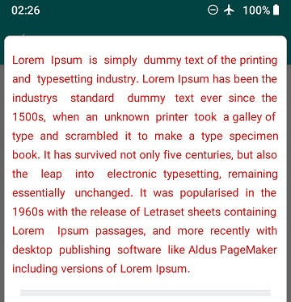
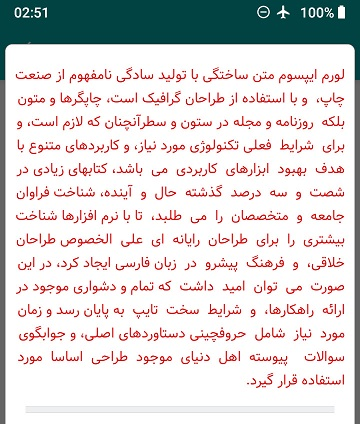

# justify-textview-android
 This is a simple implementation to get text in justified manner in any android application, also support LTR and RTL language.
 
 Simply use : 
```xml
        <yourpackagename.UIJustifiedLabel              
                android:layout_width="wrap_content"
                android:layout_height="wrap_content"
                android:text="@string/lorum_ipsum" />
```
 
 this source is modified version of :  https://github.com/nikoo28/justify-textview-android
 
## original text :



## justify text :



## persian text :


